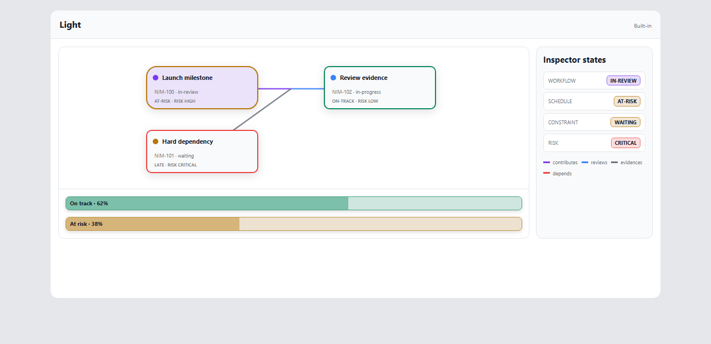
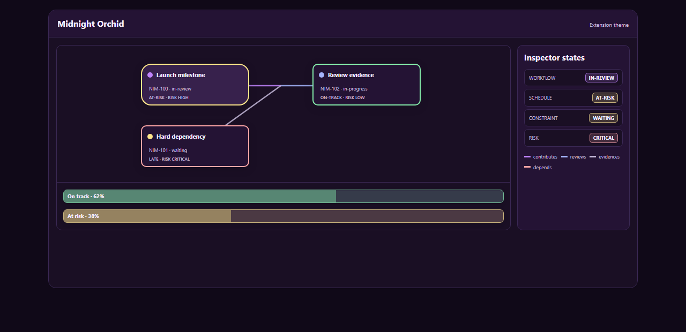

# Nimbalyst Tracker+

Tracker+ is a consent-gated Nimbalyst extension that makes the native
tracker surface easier for people and agents to understand. It combines
readable tracker comments with a Gantt-style timeline, a normalized relationship
graph, critical-path analysis, governance validation, and milestone reports.

This is an independent community extension, not an official Nimbalyst feature.
Version 0.3.0 is Windows-first and was validated with Nimbalyst 0.68.1. Because
the read adapter uses a private SQLite schema, retest after upgrading Nimbalyst.

The extension keeps its original technical ID,
`com.prediclear.nimbalyst-native-tracker-comments`, so existing installations
upgrade in place despite the broader Tracker+ name.

## Screenshots


<p align="center">
  
  
</p>

## What's new in 0.3.0

- Model workflow, schedule health, execution constraints, and risk as separate
  dimensions so a dependency does not automatically mean an item is blocked.
- Store each typed relationship once and derive backlinks and inverse labels.
- Support dependency modes, lead/lag, clearing conditions, evidence, provenance,
  and hard/soft coordination controls.
- Calculate schedule slack, deterministic risk, hard-serial critical paths, and
  dependency cycles.
- Validate milestone ownership, review evidence, orphan tasks, unassigned merge
  requests, duplicate edges, and incomplete hard dependencies.
- Project live tracker state into Timeline, Graph, and Reports views, with durable
  milestone reports and snapshot/schema/revision watermarks.
- Add compact timeline rows and responsive fit-to-width controls alongside Day,
  Week, and Month zoom.

## Timeline and relationships

The workspace includes three native custom tracker types:

- `timeline-item` separates workflow, schedule health, execution constraint,
  risk inputs, forecasts, and launch scope.
- `milestone` uses the same independent state dimensions plus milestone target,
  gate, forecast, and reporting fields.
- `timeline-link` stores one normalized relationship edge as a native tracker
  record with stable ID, source, type, target, state, dependency controls,
  evidence, provenance, and effective revision.

Relationship truth is stored once as:

`source item → relationship type → target item`

Supported types are `depends-on`, `contributes-to`, `reviews`, `evidences`,
`implements`, and `related`. Backlinks and inverse labels are derived from the
single edge record. A dependency describes topology; it does not set the
source item's execution constraint to blocked.

The `.ntimeline` custom editor provides Timeline, Graph, and Reports views. Its
tracker references link back to the durable native item. Timeline rows can be
collapsed with **Compact**, while **Fit** automatically resizes the date scale
when the editor width changes; Day, Week, or Month restores manual scaling.
In compact mode, **Critical path** toggles a red outline on calculated path
rows. **Summaries** optionally groups a task beneath its one active primary
milestone contribution; dependency edges never imply hierarchy.

The item inspector is hidden by default so the timeline uses the full editor
width. Selecting an item opens it contextually, and its close button clears the
selection and collapses the inspector again.

Tracker+ derives its palette from Nimbalyst's semantic theme variables rather
than assigning fixed purple, blue, gray, green, amber, or red fills. Timeline
labels, graph nodes, inspector badges, and report text remain on neutral or
lightly tinted host surfaces; color is carried by borders, progress fills,
workflow dots, and typed relationship edges. The contrast regression covers
Light, Dark, Crystal Dark, and Midnight Orchid; System and Auto resolve to the
corresponding Light or Dark palette.

When explicit `timeline-link` rows exist, Tracker+ resolves their source and
target records before applying response limits, includes linked archived
evidence, and does not mix in legacy relationship arrays. Opening a native
projection also hydrates primary-milestone and launch-scope dimensions from the
normalized graph. The undated lane counts only active executable work; completed
history and plans, ADRs, features, bugs, or findings remain inspectable as
evidence but do not inflate unscheduled work. Milestone windows are contextual
only—Tracker+ never invents item dates.

## Agent tools

- `native_tracker_list_comments` returns bounded, paginated comment history.
- `native_tracker_get_with_comments` returns tracker orientation and comments.
- `native_tracker_sync_timeline` projects current native tracker data into a
  workspace-relative `.ntimeline` document.
- `native_tracker_generate_milestone_report` writes a bounded Markdown report
  for one or all major milestones.

All tools take their workspace from the Nimbalyst backend context. Callers
cannot choose a database path or SQL statement. Durable tracker changes still
go through Nimbalyst's built-in `tracker_create`, `tracker_update`, and
`tracker_add_comment` tools.

## Quick start

1. Confirm **Tracker+** is enabled in Nimbalyst Extensions. New installs
   default the safe renderer contribution to enabled; backend consent remains
   first-use and opt-in.
2. Create `milestone`, `timeline-item`, and `timeline-link` tracker records in
   the native tracker.
3. Create a Tracker Timeline from the New File menu, or call
   `native_tracker_sync_timeline` with an `.ntimeline` output path.
4. Open the timeline file and switch among Timeline, Graph, and Reports.
5. Call `native_tracker_generate_milestone_report` when a durable Markdown
   status report is needed.

The included [Tracker Timeline.ntimeline](Tracker%20Timeline.ntimeline) and
[Milestone Dashboard.ntimeline](Milestone%20Dashboard.ntimeline) demonstrate
the editor against native validation items.

## Safety model

- SQLite opens with `mode=ro` and immediately enables `PRAGMA query_only = ON`.
- Every database lookup is workspace-scoped and excludes deleted/archived data.
- Comment and timeline responses are bounded; identity objects are minimized.
- The backend requests `mcp-server-register` and `workspace-files`, never the
  Nimbalyst database-write broker, secrets, or network access.
- Workspace writes are limited to validated relative `.ntimeline` and `.md`
  files explicitly requested through the generation tools.
- Python uses only the standard library, avoiding Electron native-module ABI
  packaging.

See [security.md](docs/security.md) for the complete trust boundary and
[timeline-plan.md](docs/timeline-plan.md) for the architecture and acceptance
criteria.

## Development

```powershell
npm install
npm test
npm run build
npm run verify:package
```

Build, install, reload, and inspect the extension through Nimbalyst Extension
Dev Tools as described in [installation.md](docs/installation.md).

## License

MIT. See [LICENSE](LICENSE).
