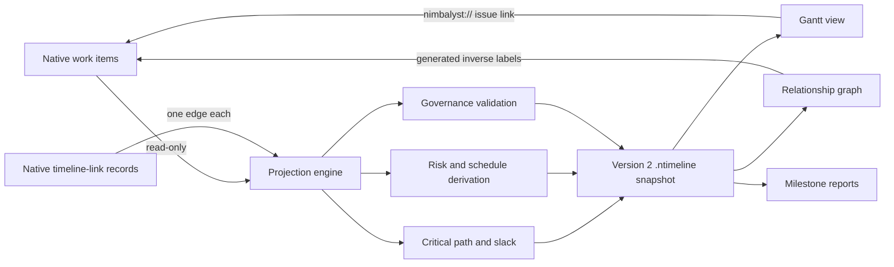

# Tracker timeline, relationship, and risk model

## Outcome

Project Nimbalyst tracker items onto a Gantt timeline, normalized relationship
graph, critical path, and milestone report without creating a second tracker
database or a tracker write path.

## Independent state dimensions

| Dimension | Values | Meaning |
| --- | --- | --- |
| Workflow | planned, in-progress, in-review, waiting, done/achieved | What the team is doing |
| Schedule health | on-track, at-risk, late | Whether the target or forecast remains credible |
| Execution constraint | clear, waiting, blocked, paused | Whether the next required action can proceed |
| Risk | low, medium, high, critical | Derived probability and consequence of failure |
| Priority | low, medium, high, critical | Business sequencing; never used as risk |

A dependency is topology only. It does not mutate workflow, schedule health, or
execution constraint. `blocked` is used only when no required next action can
proceed.

## Native tracker types

- `launch` stores the first-class launch key, lifecycle, target window, and
  release outcome used as an explicit traversal root.
- `timeline-item` stores schedule, forecast, workflow, execution constraint,
  risk inputs, owner, launch scope, gate, and source revision.
- `milestone` stores the same independent dimensions plus target date, report
  cadence, and milestone gate.
- `timeline-link` is a native edge record. Its tracker ID is the stable
  relationship ID.

Each relationship is stored once:

`source_id → relationship_type → target_id`

The target-side label is generated when rendering a backlink:

| Stored edge | Forward label | Generated inverse label |
| --- | --- | --- |
| item `part-of-launch` launch | Part of launch | Contains launch member |
| plan `governs` item | Governs | Is governed by |
| task `depends-on` proof | Depends on | Is predecessor of |
| task `contributes-to` milestone | Contributes to | Receives contribution from |
| MR `reviews` milestone | Reviews | Is reviewed by |
| evidence `evidences` task | Evidences | Is evidenced by |
| item `precedes` item | Precedes | Follows |
| item `enables` item | Enables | Is enabled by |
| item `coordinates-with` item | Coordinates with | Coordinates with |
| task `implements` plan | Implements | Is implemented by |
| item `related` item | Related to | Related to |

`timeline-link` also carries directedness, active/cleared/superseded state,
dependency mode, hard-serial/shared-resource/soft-coordination hardness,
lead/lag days, clearing condition, owner, entry/exit evidence, source evidence,
effective revision, and source revision. Creation/update timestamps come
from the native tracker row.

## Projection and analysis

Hard-serial `depends-on` edges drive a CPM-style calculation. Dependency modes
translate to start offsets, lead/lag modifies those offsets, and a forward plus
backward pass derives critical-path slack. Cycles suspend the affected path and
produce a validation error.

Schedule health is derived from stored assessment plus target-date variance,
forecast slippage, slack, technical uncertainty, capacity pressure, and
evidence confidence. Workflow never overrides schedule health.

Risk starts with a deterministic 5×5 likelihood/impact matrix:

- 1–4: low
- 5–9: medium
- 10–16: high
- 17–25: critical

Escalation floors are then applied:

- Critical-path work with zero or negative slack is at least high.
- Recurring or structural risk with hard recovery is at least high.
- An active execution blocker inside a target window is critical.

Every derived color has a rationale array in the snapshot.

## Governance validation

- Every launch-scoped item has exactly one primary `contributes-to` edge to a
  milestone; secondary contributions remain allowed.
- Every MR has exactly one `reviews` edge to a milestone, an owner, and explicit
  entry/exit evidence on that edge.
- Every hard-serial edge has an owner and clearing condition.
- Hard-dependency cycles are errors.
- Broken relationship orphans are warnings; intentionally tag-seeded
  standalone projection items use a distinct informational finding.
- Malformed or duplicate normalized edges are reported.

## Durable projection watermark

Every `.ntimeline` view displays:

- snapshot generation identifier;
- tracker snapshot timestamp;
- tracker schema fingerprint;
- source revision, or `unavailable` when no native record supplies one;
- projection document version.

The JSON document is a bounded, reproducible projection. It contains no tracker
bodies, comments, raw identity objects, deleted records, or archived records.
Regeneration preserves the document title, view, and filters. Its sync receipt
summarizes validation severity/codes and reports deterministic prior/current
node, relationship, milestone, and generation deltas.

## Acceptance criteria

- All three custom tracker types load and validate in Nimbalyst.
- A dependency does not imply an execution blocker.
- One native `timeline-link` produces one projected edge and one generated
  backlink label.
- All eleven relationship types render distinctly.
- Launch traversal includes selected external boundary nodes and edges without
  expanding through those nodes.
- Timeline regeneration preserves curated metadata and returns deterministic
  validation and projection-delta summaries.
- Timeline bars/nodes use schedule-health color, while workflow and execution
  constraint remain separately visible.
- Risk levels, rationales, slack, critical path, cycles, and governance findings
  are deterministic and covered by tests.
- Timeline and report projections carry snapshot, schema, revision, and version
  watermark fields.
- SQLite remains `mode=ro` plus `query_only`; generation writes only explicitly
  requested workspace `.ntimeline` and `.md` files.
